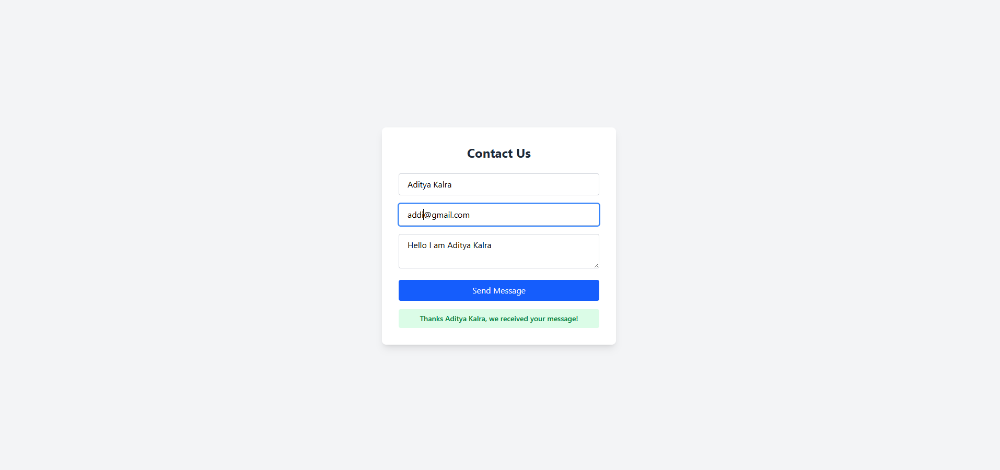

# Backend Form
    Created a Backend form that is interacting with 
    frontend and is giving the contents back to the React app.

---

## Demo / Preview

<!-- Add a screenshot, video, or link to live demo -->
  

---

## Features

- Backend and Frontend Form Interaction
- Response generation from Express

---

## Tech Stack

**Client:** React
**Backend:** Express
---

### Prerequisites

- Node.js / 

### Running

     Running the Server through node index.js by going to ./server>
     Running the Frontend through npm run dev by going to ./formhandling>